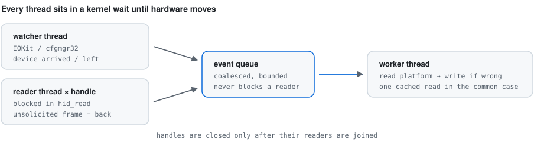

# Contributing

## The most useful contribution

A `logiswitch probe` dump from a Logitech device that is not yet confirmed
working. Support is discovered from the hardware rather than hardcoded, so a
dump either confirms a model works or shows exactly why it does not.

Open an issue with the output and how the device is connected (receiver,
Bluetooth, or USB cable).

## Development setup

```bash
git clone https://github.com/App-Builders-Gang/logitech-layout-auto-switcher.git
cd logitech-layout-auto-switcher
python -m venv .venv
.venv/bin/pip install -e ".[dev]"      # .venv\Scripts\pip on Windows
```

```bash
pytest                  # 165 tests, no hardware required
pytest --cov            # with coverage
ruff check . && ruff format --check .
mypy logiswitch
```

Or install the hooks and let them run for you:

```bash
pip install pre-commit && pre-commit install
```

### What the harness enforces for you

- **Thread and handle leaks fail the test that caused them.** An autouse fixture
  checks after every test, so a forgotten `close()` is attributed correctly
  instead of surfacing later as an unrelated flake.
- **Warnings are errors**, including `ResourceWarning` — that is how the leaked
  logging file handle was found.
- **Tests must not depend on order.** Logger state is snapshotted and restored
  between tests; nothing else may leak global state either.
- **No fixed settle sleeps.** Wait on the condition, not the clock — use the
  `wait_for` / `wait_until_settled` helpers in `tests/test_agent.py`. A fixed
  sleep passes locally and fails on a loaded CI runner.
- A per-test timeout means a deadlock fails with a traceback rather than hanging
  the job.

## Testing without hardware

`tests/fakehid.py` is a HID++ receiver simulator replaying the exact byte
sequences captured from a Logi Bolt receiver and an MX Keys S. Point the backend
at it and the whole stack runs:

```python
fakehid.install(monkeypatch, fakehid.FakeReceiver([fakehid.mx_keys_s()]))
```

Add a `FakeDevice` for new hardware rather than mocking at a higher level — that
is what keeps the protocol layer honest.

## How the pieces fit

<picture>
  <source media="(prefers-color-scheme: dark)" srcset="assets/architecture-dark.svg">
  
</picture>

```
logiswitch/
  hidpp/protocol.py    framing, error decoding, OS masks — pure, fully unit-tested
  hidpp/transport.py   handles + one reader thread each + request/notification dispatch
  hidpp/device.py      capability probing and the cached platform table
  hidpp/discovery.py   endpoint enumeration and fan-out device scan
  watchers/windows.py  CM_Register_Notification (cfgmgr32)
  watchers/darwin.py   IOKit service matching on a dedicated CFRunLoop thread
  agent.py             the event-driven supervisor
```

## Things worth knowing before you change code

- **The reader threads are the only readers.** Anything that calls `read()`
  outside `Transport._read_loop` reintroduces the race that lost device-wake
  notifications in v1.
- **ctypes callbacks must stay referenced.** `WindowsWatcher._native_callback`,
  `DarwinWatcher._native_matched` and friends are held on the instance on
  purpose; the OS keeps raw pointers to them and collecting one crashes the
  process on the next device event.
- **No polling.** If you need to know something changed, subscribe to it. The
  polling watcher exists only as a fallback when native registration fails.
- **The platform table is firmware-constant** and cached per session. Re-reading
  it turned a 15 ms check into a 326 ms one in v1.

## Style

`ruff` and `mypy` must be clean. Match the surrounding code; comments explain
*why*, not *what*.

## Platform coverage

CI runs the suite on Windows and macOS. The macOS device-notification watcher
(`watchers/darwin.py`) has not been exercised on real Apple hardware yet — if you
have a Mac and a Logitech receiver, confirming or fixing it is very welcome.
