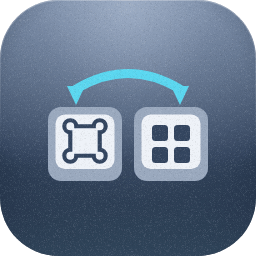

<div align="center">

<!-- BEGIN abd3lraouf-studios:hero -->
<p align="center">
    
</p>

<h1 align="center">Layout Auto Switcher</h1>

<p align="center">
    <strong>Detects which machine the KVM just handed the keyboard to and switches the layout to match.</strong><br>
    Windows · macOS · MIT
</p>

<p align="center">
    <a href="https://github.com/abd3lraouf-studios/logitech-layout-auto-switcher/releases/latest"><strong>Get it on GitHub →</strong></a>
</p>

<p align="center">
    <a href="https://abd3lraouf.dev/projects/layout-auto-switcher/">abd3lraouf.dev/projects/layout-auto-switcher/</a>
</p>
<!-- END abd3lraouf-studios:hero -->

Automatically switches a Logitech keyboard between **Mac and Windows layouts** the
instant a KVM, Easy-Switch channel or cable hands it to another machine — so you
never hold **Fn+O / Fn+P** for seven seconds again.

[](https://github.com/abd3lraouf-studios/logitech-layout-auto-switcher/actions/workflows/ci.yml)
[](https://github.com/abd3lraouf-studios/logitech-layout-auto-switcher/actions/workflows/codeql.yml)
[](https://github.com/abd3lraouf-studios/logitech-layout-auto-switcher/releases/latest)
[](LICENSE)
[](https://www.python.org/downloads/)
[](docs/INSTALL.md)


</div>

---

## The problem

You share one Logitech keyboard between a Mac and a PC. Every single time you
switch machines, the modifier keys are wrong — ⌘ acts like Alt, `@` and `"` swap
places — and the only fix is holding **Fn+O** or **Fn+P** for several seconds and
waiting for the keyboard to re-pair.

If any of these sound familiar, this fixes it:

- *MX Keys stuck in Mac layout on Windows*
- *MX Keys Command key acts as Alt after switching computers*
- *How to switch MX Keys between Mac and Windows automatically*
- *KVM switch does not change Logitech keyboard layout*
- *Logi Options+ does not switch the keyboard OS when I change computers*

## The fix

<picture>
  <source media="(prefers-color-scheme: dark)" srcset="assets/kvm-dark.svg">
  
</picture>

Fn+O / Fn+P are not keyboard-only magic. They write a firmware value that is also
reachable over Logitech's HID++ 2.0 protocol — feature `0x4531 MULTIPLATFORM`,
function `setHostPlatform`. This project writes exactly that value, automatically,
triggered by the operating system's own device-arrival notifications.

No remapping. No Karabiner layer. No AutoHotkey script pretending keys are
something else. The **keyboard itself** changes mode, exactly as if you had held
the key combination.

## Why Logi Options+ can't fix this on a KVM

Options+ *does* drive this feature. So why is the layout still wrong after every
switch, even with Options+ installed on both machines?

Because of **when** it acts. Measured on macOS, Options+ 2.6.941708:

> **Logi Options+ corrects the layout once, shortly after its agent starts — about
> seven seconds — and never again.**

<picture>
  <source media="(prefers-color-scheme: dark)" srcset="assets/optionsplus-dark.svg">
  
</picture>

Three measurements, all reproducible, and all with **"Always keep the keyboard in Mac
layout" switched on**:

| What was done | What Options+ did |
|---|---|
| Set the keyboard to the wrong platform under a **running** Options+, 35 s | nothing |
| Same, with its **window open**, 45 s | nothing |
| Set it wrong, then **restarted its agent** | corrected in ~7 s, every time |

**A KVM switch restarts nothing.** It moves the receiver to the other machine and
that machine's Options+ has been running for hours — so nothing re-asserts, and the
keyboard keeps whatever layout the last computer left it in. That gap is the whole
reason this project exists: it fires on device *arrival*, the event Options+ ignores,
and writes the same value Options+ would want, so the two agree rather than fight.

Worth saying plainly, because it is not what the setting's name implies: leaving
**"Always keep the keyboard in Mac layout"** switched on did not keep the keyboard in
Mac layout across a switch. The full measurements are in
**[docs/PROTOCOL.md](docs/PROTOCOL.md)**.

## How it compares

| | Logi Options+ | Karabiner-Elements | Solaar | **This** |
|---|---|---|---|---|
| Switches the keyboard's real layout | yes | no — remaps keys | yes | **yes** |
| Reacts to a KVM / host change | **no** | n/a | manual | **yes, automatically** |
| Windows | yes | no | no | **yes** |
| macOS | yes | yes | no | **yes** |
| Linux | no | no | yes | not yet |
| Runs headless, no account | no | yes | yes | **yes** |
| Idle CPU | background service | event tap | daemon | **~45 ms / 60 s measured** |

The "reacts to a KVM" row is measured, not assumed: Options+ writes the platform
once when its agent registers the device and not again, so a KVM switch — which
restarts nothing — leaves it silent. Method and captured frames in
**[docs/PROTOCOL.md](docs/PROTOCOL.md)**.

Solaar is excellent and covers Linux thoroughly — this exists because it is
Linux-only, and the problem lives on Windows and macOS.

## Install

One line per machine. Install on **both** — each asserts only its own OS, so they
never fight. No administrator rights, nothing to clone, nothing to configure.

**Windows** (PowerShell)

```powershell
irm https://raw.githubusercontent.com/abd3lraouf-studios/logitech-layout-auto-switcher/main/install.ps1 | iex
```

**macOS / Linux**

```bash
curl -fsSL https://raw.githubusercontent.com/abd3lraouf-studios/logitech-layout-auto-switcher/main/install.sh | bash
```



Then `logiswitch doctor` tells you what it found and, if anything is wrong, which of
the three causes of wrong characters it is.

Each installer detects the OS and Python for you, downloads the project, builds an
isolated virtualenv, checks your keyboard actually answers, and registers a logon
service — a Scheduled Task on Windows, a launchd LaunchAgent on macOS.

<details>
<summary>From a clone, or with options</summary>

```bash
git clone https://github.com/abd3lraouf-studios/logitech-layout-auto-switcher.git
cd logitech-layout-auto-switcher
./install.sh            # macOS / Linux
.\install.ps1           # Windows
```

The same scripts work either way. To pin the target OS instead of auto-detecting:

```bash
curl -fsSL https://raw.githubusercontent.com/.../install.sh | bash -s -- --os macos
```
```powershell
$env:LOGISWITCH_OS='macos'; irm https://raw.githubusercontent.com/.../install.ps1 | iex
```

Uninstall:

```bash
curl -fsSL https://raw.githubusercontent.com/.../install.sh | bash -s -- --uninstall
```
```powershell
$env:LOGISWITCH_UNINSTALL='1'; irm https://raw.githubusercontent.com/.../install.ps1 | iex
```

</details>

Full guide: **[docs/INSTALL.md](docs/INSTALL.md)**.

```bash
logiswitch status      # what is attached and what it is set to
logiswitch set mac     # switch everything once, right now
logiswitch watch       # run the agent in the foreground
logiswitch doctor      # why is the keyboard typing the wrong characters?
logiswitch notify-test # check desktop notifications are permitted
logiswitch bundle      # pack logs + device dump into one file for a bug report
logiswitch probe       # full HID++ dump for bug reports
logiswitch update      # bring this installation up to the latest release
logiswitch uninstall   # remove the logon service
```

### Staying up to date

Once installed, each machine keeps itself current on its own:

```bash
logiswitch update          # stop, fetch the latest release wheel, install, restart
logiswitch update --check  # just report whether an update is available
```

`update` pulls the wheel from this repository's [latest release](https://github.com/abd3lraouf-studios/logitech-layout-auto-switcher/releases/latest)
using only the Python standard library — no PyPI account, no extra dependency. It
stops the running agent first (Windows locks files a running process holds),
installs, and restarts it; if the install fails the old build is restarted so the
machine is never left without an agent. The `update` command itself ships from
v2.0.4 — to get there the first time, re-run the install one-liner above.

## Several machines sharing one keyboard

Run the agent on every machine. They take turns automatically: **the machine you are
typing on owns the keyboard, and the rest stand down.**

<picture>
  <source media="(prefers-color-scheme: dark)" srcset="assets/arbitration-dark.svg">
  
</picture>

No configuration and no negotiation — which matters, because the machines have no way
to talk to each other. It works because only one machine can be receiving your
keystrokes at a time, so each agent reaches the same answer on its own by asking its
OS how long since anyone used it. It scales to any number of machines.

Two topologies, both handled:

- **Shared receiver (KVM)** — every machine sees the same receiver, so the keyboard
  has one platform slot and they genuinely compete for it. Taking turns is the fix.
- **A receiver per machine** — each machine owns a different Easy-Switch slot and
  there is no competition. Add `--claim-host N` if you want to pin it explicitly.

Escapes when the automatic behaviour is not what you want:

```bash
logiswitch watch --observe            # never change the layout, just report
logiswitch install --observe          # ...and make that permanent
logiswitch watch --active-window 60   # wait longer before yielding
logiswitch watch --claim-host 1       # only ever set Easy-Switch host 1
```

If the layout still flips back and forth, one machine is probably running an old
build — those do not take turns. The log names it outright:

```
another machine is running an OLD logiswitch (software id 0x0E) and setting this
keyboard's platform. Old builds do not take turns -- update logiswitch on that machine
```

## Notifications

The agent tells you on the desktop when the layout changes — on macOS and Windows —
and when something is wrong: a switch that would not stick, a layout that keeps
reverting, an unstable wireless link, or a host input source that is not Latin.

They are **throttled**, which matters more than it sounds. A keyboard whose platform
keeps reverting can be corrected every few seconds; reporting each one would mean
hundreds of notifications an hour. Instead each kind of message has a cooldown, and a
fault that keeps recurring is reported once as a standing condition — *"the layout
keeps reverting … run logiswitch doctor"* — with the count of what was hidden.

On by default. Turn them off with `logiswitch watch --no-notify`, or for the
installed agent:

```bash
logiswitch install --no-notify
```

If nothing appears, the notification is being blocked rather than not sent — run
`logiswitch notify-test` and check **System Settings → Notifications → Script
Editor** on macOS (that is who macOS attributes an `osascript` notification to), or
**Settings → System → Notifications** on Windows.

## When the keyboard types the wrong characters

Three different faults look identical from the keyboard, and only the first is
one this tool can fix. Run **`logiswitch doctor`** — it checks all three and names
which one you have:

| What you see | What it actually is |
| --- | --- |
| `⌘`/`Alt` swapped, `@` types `"` | The keyboard's firmware is in the wrong platform mode. This is what logiswitch corrects. |
| A different alphabet entirely | Your *host* input source, e.g. Arabic instead of Latin. logiswitch does not manage this — switch it with `⌃Space` (macOS) or `Alt+Shift` / `Win+Space` (Windows). |
| Dropped, repeated or garbled keys | The wireless link, not the layout. Interference, a low battery or a failing receiver. |

`doctor` writes its report next to the log so it can be attached to a bug report.
For a fault that only shows up occasionally, leave the agent running with tracing
on and re-run `doctor` the moment it happens:

```bash
logiswitch watch -v --trace
```

That records every HID++ frame in a ring buffer and dumps the recent ones to
`logiswitch.trace.log` whenever something anomalous occurs — a reply arriving
after its deadline, a platform write that did not take, or a link that keeps
dropping.

On macOS, opening the receiver needs **Input Monitoring** (System Settings →
Privacy & Security). Without it the device still enumerates but will not open, which
looks like a hardware fault and is not one; `doctor` detects that case and says so.

Protocol references, and the two hard-won workarounds this project inherited from
Solaar, are in **[docs/RESOURCES.md](docs/RESOURCES.md)**.

## Supported devices

**Whatever your hardware says it supports.** There is no model allow-list to fall
out of date. Every Logitech interface exposing the HID++ vendor collection is
enumerated, every device behind it is asked what it can do, and anything
advertising `0x4531 MULTIPLATFORM` (or the older two-bucket `0x4530 DUALPLATFORM`)
is driven. A keyboard released next year works with no code change.

- **Connections** — Logi Bolt, Unifying, Nano and Lightspeed receivers, plus
  devices connected directly over **Bluetooth or a USB cable** (HID++ index `0xFF`)
- **Multiple devices** — every supported device found is switched, not just the first
- **Unsupported devices** — probed once, marked, and never queried again

Verified end-to-end on an **MX Keys S** via a Logi Bolt receiver behind a TESmart
KVM, alongside an MX Master 3S (correctly identified as unable to switch layout).
Other models should work by capability; reports welcome.

## Built to sit still

The agent's job is to do nothing, very cheaply, until hardware moves.

<picture>
  <source media="(prefers-color-scheme: dark)" srcset="assets/latency-dark.svg">
  
</picture>

| Measured | |
|---|---|
| CPU over 60 s idle | **~45 ms**, three re-checks |
| Steady-state check | **15 ms**, one HID++ read |
| Easy-Switch return corrected in | **1.1 s** (MX Keys S on a Bolt receiver) |
| Discovery of all 7 device slots | **836 ms** |
| Platform switch | **326 ms** |
| 300 + 20 open/close cycles | zero thread growth, flat RSS |
| Shutdown on SIGTERM | ~0.5 s |

**Event-driven first.** Device changes come from `CM_Register_Notification` on
Windows (the modern, window-handle-free API) and IOKit service matching on macOS.
Device *wake* comes from the device itself: whatever it says first on reconnect —
`0x4220`, `0x1D4B`, `0x0020`, or a receiver's HID++ `0x41` — is taken as "I am
back". Every thread sits in a kernel wait; nothing spins. A polling watcher exists
only as a fallback if native registration fails.

**One backstop, on purpose.** An Easy-Switch move leaves the receiver plugged in,
so the OS reports nothing and the agent could otherwise sit idle while the layout
is wrong. A 20 s re-check (`--reassert`, one cached read) bounds that. Measured on
real hardware, the announcement path recovers in ~1 s and the backstop never fires.

**Deterministic cleanup.** Reader threads are joined before handles close, a
partial open closes what it already acquired, signals unwind the whole stack, and
the static platform table is cached so the common case is a single read.

## FAQ

**Does this modify my keyboard's firmware?**
No. It writes the same value the Fn+O / Fn+P chord writes. Worst case the keyboard
sits in the wrong mode, fixed by pressing the chord.

**Do I need administrator rights?**
No, on either platform. HID++ access does not require elevation.

**Does it need Logi Options+?**
No — and it coexists with it. See above for the one case where they conflict.

**Will it fight with Options+?**
Not while both target the same OS, which is the normal case — measured over twenty
minutes on a Mac running both, Options+ sent 5,952 frames and not one of them set
the platform. Point them at different platforms and they do disagree; see
[above](#why-logi-options-cant-fix-this-on-a-kvm).

One thing does change while Options+ is running: this machine stops taking turns
with other machines over a shared keyboard, because the protocol reports a peer
machine and a local program identically, and yielding to a program nobody is typing
on would leave the layout wrong for whoever types next. `logiswitch doctor` says so
under `sharing`. To get turn-taking back, quit Options+ or run the agent with
`--observe` on the machine that should yield.

**My KVM only switches video, not USB.**
Then nothing disconnects and there is no arrival event — the same situation as an
Easy-Switch move, where the receiver stays plugged in. The agent reacts to the
device speaking up when it reconnects (measured: ~1 s), and re-checks every 20 s
as a backstop; tune it with `--reassert`.

**Linux?**
Not yet — [Solaar](https://github.com/pwr-Solaar/Solaar) already does this well
there. The core is platform-neutral, so a udev watcher would be a small addition.

**Is macOS tested?**
Yes, on real hardware as well as in CI — and doing so was worth it. The IOKit
watcher had been registering its terminate notification under the wrong constant
(`IOServiceTerminated`; the header spells it `IOServiceTerminate`), so it failed
with `kIOReturnUnsupported` on every Mac and silently fell back to polling. Fixed
in 2.0.1. The Easy-Switch round trip that 2.0.2 addresses was found the same way,
by watching an MX Keys S move between a Mac and a PC and reading the frames.

<!-- BEGIN abd3lraouf-studios:press -->
## Press & marketing assets

Layout Auto Switcher switches between Mac and Windows keyboard layouts the instant a KVM hands the keyboard over. MIT licensed.

**Naming.** Written "Layout Auto Switcher" in body copy. The full name, "Logitech Layout Auto Switcher", is used on first mention only. Logitech is a third-party trademark and the project is unaffiliated.

The press kit — icons, screen art, boilerplate, the fact sheet and a downloadable
archive — is at **[abd3lraouf.dev/press/layout-auto-switcher/](https://abd3lraouf.dev/press/layout-auto-switcher/)**.
<!-- END abd3lraouf-studios:press -->

## Contributing

Issues and PRs welcome — see [CONTRIBUTING.md](CONTRIBUTING.md). The most useful
contribution is a `logiswitch probe` dump from a Logitech device not yet
confirmed working.

## License

MIT — see [LICENSE](LICENSE).

## Credits

Protocol groundwork stands on [Solaar](https://github.com/pwr-Solaar/Solaar),
[Logitech's `cpg-docs`](https://github.com/Logitech/cpg-docs), and
[lekensteyn's HID++ 1.0 notes](https://lekensteyn.nl/logitech-unifying.html).

The MX Keys illustration in the banner is **“FREE - Logitech MX Keys - Vector”**
by **David Pokorný (@davidpokornys)**, published on the Figma Community. It is
used here cropped to the keyboard and re-optimised; see
[`assets/keyboard-mx-keys.svg`](assets/keyboard-mx-keys.svg).

*Logitech*, *logi* and *MX Keys* are trademarks of Logitech; the Apple logo and
the Windows logo are trademarks of Apple Inc. and Microsoft Corporation. They
appear here only to identify the hardware this project drives and the platforms it
targets. This project is not affiliated with, endorsed by, or sponsored by any of
them.
