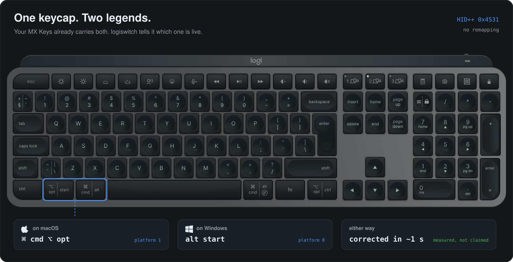
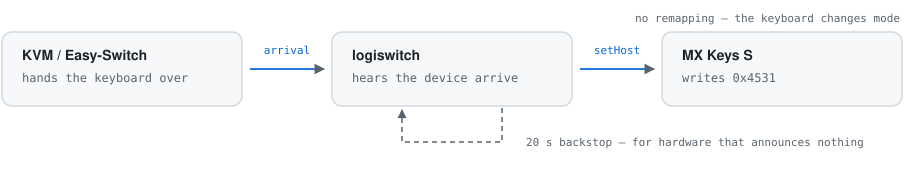
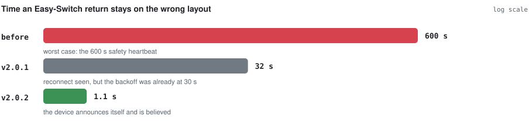

<div align="center">

# Logitech Layout Auto Switcher

**Your MX Keys should know which computer it is plugged into. Now it does.**

Automatically switches a Logitech keyboard between **Mac and Windows layouts** the
instant a KVM, Easy-Switch channel or cable hands it to another machine — so you
never hold **Fn+O / Fn+P** for seven seconds again.

[](https://github.com/App-Builders-Gang/logitech-layout-auto-switcher/actions/workflows/ci.yml)
[](https://github.com/App-Builders-Gang/logitech-layout-auto-switcher/actions/workflows/codeql.yml)
[](https://github.com/App-Builders-Gang/logitech-layout-auto-switcher/releases/latest)
[](LICENSE)
[](https://www.python.org/downloads/)
[](docs/INSTALL.md)



</div>

---

## The problem

You share one Logitech keyboard between a Mac and a PC. Every single time you
switch machines, the modifier keys are wrong — ⌘ acts like Alt, `@` and `"` swap
places — and the only fix is holding **Fn+O** or **Fn+P** for several seconds and
waiting for the keyboard to re-pair.

If any of these sound familiar, this fixes it:

- *MX Keys stuck in Mac layout on Windows*
- *MX Keys Command key acts as Alt after switching computers*
- *How to switch MX Keys between Mac and Windows automatically*
- *KVM switch does not change Logitech keyboard layout*
- *Logi Options+ does not switch the keyboard OS when I change computers*

## The fix

<picture>
  <source media="(prefers-color-scheme: dark)" srcset="assets/flow-dark.svg">
  
</picture>

Fn+O / Fn+P are not keyboard-only magic. They write a firmware value that is also
reachable over Logitech's HID++ 2.0 protocol — feature `0x4531 MULTIPLATFORM`,
function `setHostPlatform`. This project writes exactly that value, automatically,
triggered by the operating system's own device-arrival notifications.

No remapping. No Karabiner layer. No AutoHotkey script pretending keys are
something else. The **keyboard itself** changes mode, exactly as if you had held
the key combination.

## Install

One line per machine. Install on **both** — each asserts only its own OS, so they
never fight. No administrator rights, nothing to clone, nothing to configure.

**Windows** (PowerShell)

```powershell
irm https://raw.githubusercontent.com/App-Builders-Gang/logitech-layout-auto-switcher/main/install.ps1 | iex
```

**macOS / Linux**

```bash
curl -fsSL https://raw.githubusercontent.com/App-Builders-Gang/logitech-layout-auto-switcher/main/install.sh | bash
```

Each installer detects the OS and Python for you, downloads the project, builds an
isolated virtualenv, checks your keyboard actually answers, and registers a logon
service — a Scheduled Task on Windows, a launchd LaunchAgent on macOS.

<details>
<summary>From a clone, or with options</summary>

```bash
git clone https://github.com/App-Builders-Gang/logitech-layout-auto-switcher.git
cd logitech-layout-auto-switcher
./install.sh            # macOS / Linux
.\install.ps1           # Windows
```

The same scripts work either way. To pin the target OS instead of auto-detecting:

```bash
curl -fsSL https://raw.githubusercontent.com/.../install.sh | bash -s -- --os macos
```
```powershell
$env:LOGISWITCH_OS='macos'; irm https://raw.githubusercontent.com/.../install.ps1 | iex
```

Uninstall:

```bash
curl -fsSL https://raw.githubusercontent.com/.../install.sh | bash -s -- --uninstall
```
```powershell
$env:LOGISWITCH_UNINSTALL='1'; irm https://raw.githubusercontent.com/.../install.ps1 | iex
```

</details>

Full guide: **[docs/INSTALL.md](docs/INSTALL.md)**.

```bash
logiswitch status      # what is attached and what it is set to
logiswitch set mac     # switch everything once, right now
logiswitch watch       # run the agent in the foreground
logiswitch probe       # full HID++ dump for bug reports
logiswitch update      # bring this installation up to the latest release
logiswitch uninstall   # remove the logon service
```

### Staying up to date

Once installed, each machine keeps itself current on its own:

```bash
logiswitch update          # stop, fetch the latest release wheel, install, restart
logiswitch update --check  # just report whether an update is available
```

`update` pulls the wheel from this repository's [latest release](https://github.com/App-Builders-Gang/logitech-layout-auto-switcher/releases/latest)
using only the Python standard library — no PyPI account, no extra dependency. It
stops the running agent first (Windows locks files a running process holds),
installs, and restarts it; if the install fails the old build is restarted so the
machine is never left without an agent. The `update` command itself ships from
v2.0.4 — to get there the first time, re-run the install one-liner above.

## Why Logi Options+ doesn't fix this

Options+ *does* drive this feature — so why is the layout still wrong after every
switch, even with Options+ installed on both machines?

Measured on real hardware: with `logioptionsplus_agent` running, setting the
keyboard to macOS mode on a Windows host reverted to Windows in **under 0.5 s**,
every time. Stop that process and the change persists indefinitely. So Options+
is clearly enforcing something.

The gap is *when* it enforces:

> **Logi Options+ reverts a platform change it observes. It never asserts when its
> own host merely becomes the active one.**

A KVM switch changes which computer owns the dongle **without changing the
platform value**. No change event exists, so neither machine's Options+ reacts,
and the keyboard keeps whatever layout the other computer left it in.

This agent fires on exactly that missing event — device arrival — and targets the
same value Options+ wants, so the two cooperate instead of fighting. Full
write-up with frames: **[docs/PROTOCOL.md](docs/PROTOCOL.md)**.

## How it compares

| | Logi Options+ | Karabiner-Elements | Solaar | **This** |
|---|---|---|---|---|
| Switches the keyboard's real layout | yes | no — remaps keys | yes | **yes** |
| Reacts to a KVM / host change | **no** | n/a | manual | **yes, automatically** |
| Windows | yes | no | no | **yes** |
| macOS | yes | yes | no | **yes** |
| Linux | no | no | yes | not yet |
| Runs headless, no account | no | yes | yes | **yes** |
| Idle CPU | background service | event tap | daemon | **~45 ms / 60 s measured** |

Solaar is excellent and covers Linux thoroughly — this exists because it is
Linux-only, and the problem lives on Windows and macOS.

## Supported devices

**Whatever your hardware says it supports.** There is no model allow-list to fall
out of date. Every Logitech interface exposing the HID++ vendor collection is
enumerated, every device behind it is asked what it can do, and anything
advertising `0x4531 MULTIPLATFORM` (or the older two-bucket `0x4530 DUALPLATFORM`)
is driven. A keyboard released next year works with no code change.

- **Connections** — Logi Bolt, Unifying, Nano and Lightspeed receivers, plus
  devices connected directly over **Bluetooth or a USB cable** (HID++ index `0xFF`)
- **Multiple devices** — every supported device found is switched, not just the first
- **Unsupported devices** — probed once, marked, and never queried again

Verified end-to-end on an **MX Keys S** via a Logi Bolt receiver behind a TESmart
KVM, alongside an MX Master 3S (correctly identified as unable to switch layout).
Other models should work by capability; reports welcome.

## Built to sit still

The agent's job is to do nothing, very cheaply, until hardware moves.

<picture>
  <source media="(prefers-color-scheme: dark)" srcset="assets/latency-dark.svg">
  
</picture>

| Measured | |
|---|---|
| CPU over 60 s idle | **~45 ms**, three re-checks |
| Steady-state check | **15 ms**, one HID++ read |
| Easy-Switch return corrected in | **1.1 s** (MX Keys S on a Bolt receiver) |
| Discovery of all 7 device slots | **836 ms** |
| Platform switch | **326 ms** |
| 300 + 20 open/close cycles | zero thread growth, flat RSS |
| Shutdown on SIGTERM | ~0.5 s |

**Event-driven first.** Device changes come from `CM_Register_Notification` on
Windows (the modern, window-handle-free API) and IOKit service matching on macOS.
Device *wake* comes from the device itself: whatever it says first on reconnect —
`0x4220`, `0x1D4B`, `0x0020`, or a receiver's HID++ `0x41` — is taken as "I am
back". Every thread sits in a kernel wait; nothing spins. A polling watcher exists
only as a fallback if native registration fails.

**One backstop, on purpose.** An Easy-Switch move leaves the receiver plugged in,
so the OS reports nothing and the agent could otherwise sit idle while the layout
is wrong. A 20 s re-check (`--reassert`, one cached read) bounds that. Measured on
real hardware, the announcement path recovers in ~1 s and the backstop never fires.

**Deterministic cleanup.** Reader threads are joined before handles close, a
partial open closes what it already acquired, signals unwind the whole stack, and
the static platform table is cached so the common case is a single read.

## How it works

<picture>
  <source media="(prefers-color-scheme: dark)" srcset="assets/architecture-dark.svg">
  
</picture>

```
logiswitch/
  hidpp/protocol.py    framing, error decoding, OS masks — pure, fully unit-tested
  hidpp/transport.py   handles + one reader thread each + request/notification dispatch
  hidpp/device.py      capability probing and the cached platform table
  hidpp/discovery.py   endpoint enumeration and fan-out device scan
  watchers/windows.py  CM_Register_Notification (cfgmgr32)
  watchers/darwin.py   IOKit service matching on a dedicated CFRunLoop thread
  agent.py             the event-driven supervisor
```

Tests replay the exact byte sequences captured from real hardware
(`tests/fakehid.py`), so the protocol layer is covered on machines with no
Logitech device attached.

```bash
pip install -e ".[dev]" && pytest
```

## FAQ

**Does this modify my keyboard's firmware?**
No. It writes the same value the Fn+O / Fn+P chord writes. Worst case the keyboard
sits in the wrong mode, fixed by pressing the chord.

**Do I need administrator rights?**
No, on either platform. HID++ access does not require elevation.

**Does it need Logi Options+?**
No — and it coexists with it. See above for the one case where they conflict.

**Will it fight with Options+?**
Only if they target different platforms on the same machine. Then Options+ wins,
and the log tells you so after three reverts.

**My KVM only switches video, not USB.**
Then nothing disconnects and there is no arrival event — the same situation as an
Easy-Switch move, where the receiver stays plugged in. The agent reacts to the
device speaking up when it reconnects (measured: ~1 s), and re-checks every 20 s
as a backstop; tune it with `--reassert`.

**Linux?**
Not yet — [Solaar](https://github.com/pwr-Solaar/Solaar) already does this well
there. The core is platform-neutral, so a udev watcher would be a small addition.

**Is macOS tested?**
Yes, on real hardware as well as in CI — and doing so was worth it. The IOKit
watcher had been registering its terminate notification under the wrong constant
(`IOServiceTerminated`; the header spells it `IOServiceTerminate`), so it failed
with `kIOReturnUnsupported` on every Mac and silently fell back to polling. Fixed
in 2.0.1. The Easy-Switch round trip that 2.0.2 addresses was found the same way,
by watching an MX Keys S move between a Mac and a PC and reading the frames.

## Contributing

Issues and PRs welcome — see [CONTRIBUTING.md](CONTRIBUTING.md). The most useful
contribution is a `logiswitch probe` dump from a Logitech device not yet
confirmed working.

## License

MIT — see [LICENSE](LICENSE).

## Credits

Protocol groundwork stands on [Solaar](https://github.com/pwr-Solaar/Solaar),
[Logitech's `cpg-docs`](https://github.com/Logitech/cpg-docs), and
[lekensteyn's HID++ 1.0 notes](https://lekensteyn.nl/logitech-unifying.html).

The MX Keys illustration in the banner is **“FREE - Logitech MX Keys - Vector”**
by **David Pokorný (@davidpokornys)**, published on the Figma Community. It is
used here cropped to the keyboard and re-optimised; see
[`assets/keyboard-mx-keys.svg`](assets/keyboard-mx-keys.svg).

*Logitech*, *logi* and *MX Keys* are trademarks of Logitech; the Apple logo and
the Windows logo are trademarks of Apple Inc. and Microsoft Corporation. They
appear here only to identify the hardware this project drives and the platforms it
targets. This project is not affiliated with, endorsed by, or sponsored by any of
them.
